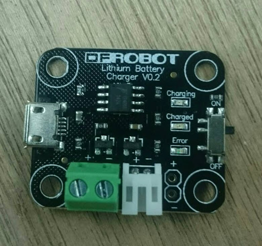
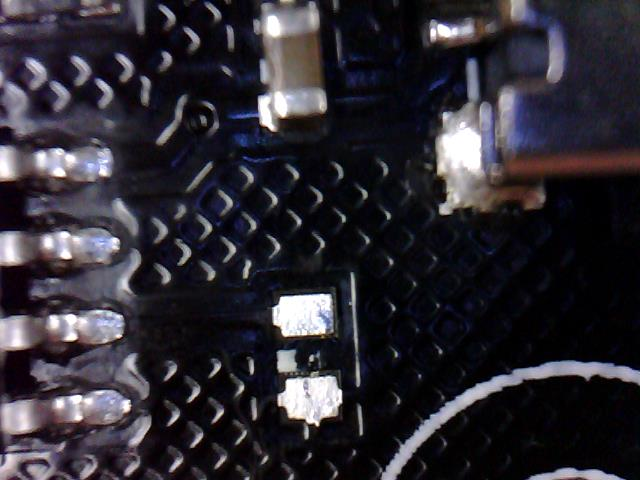
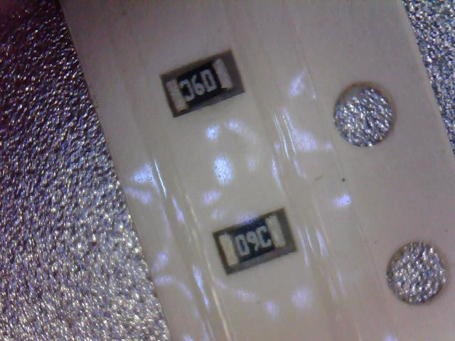
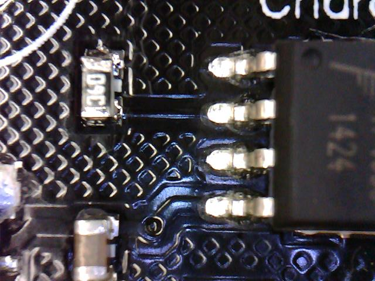

## Objectives

1. Charger Components
2. Tasks
3. Issues

---.class #id

## Charger Components

* Module
 * Lithium Battery Charge V0.2
* Lithium Ion (7V 150mAH)

[Schema of the chip][1]

--- .class #id

## Schematics

Specifications

--- .class #id

## Initial Tasks
1. Check the charing settings of the charge controller IC for the current and voltage it will be charging at.
2. Check the Lithium Ion Battery's settings for the charging current and capacity. Compare the controller IC and the battery and see if they are compatible.

--- .class #id 

## Issue: Rating Difference
1. Off the shelf charger **NOT** suitable for charging the basic lithium battery itself
2. Based of calculation provided in the dataseet, the charger will charge at 0.6A whereas the battery is rated at charging current of 150mAh
3. Use an empty line followed by three dashes to separate slides!

--- .class #id 

## Formula

I(Bat) = V(Prog) * 1200 / R(Prog)

Keeping the current constant, we figure out the 

| Symbol      | Description     | Value           |
| ----        | ---             | ---             |
| **I**(Bat)  | BAT Pin Current | 150mAh / 100mAh |
| **V**(Prog) | Voltage         | 1V              |
| R(Prog)     | Resistance      | 8/12 kOhm       |

--- .class #id

## Removing the resistor

### Desoldering
* Temperature 380 degrees Celcius
* Air Volume 3.5Pa

--- .class #id

## Demo: Removing the existing resistor

NOTE:: Rmbr to clean up using the desoldering wick
1. dip the wick in the flux (which is a weak acid; which will remove the oxided parts)
2. cover the soldering lumps with the wick and apply the soldering gun
3. Rub
4. flux cleaner on cotton buds and clean the board

---.class #id

## Demo: Removing the existing resistor

---.class #id

## Demo: Putting in the new resistor

---.class #id

## Demo: Putting in the new resistor

* Find the resistor using **Electrodroid** (reliable according to Joo Khai)
 * there’s different standard that exists
* Upside of the resistor has a label
---.class #id

## Demo: Surface Mount Devices (SMD) Soldering

1. use board-vice, 
2. add solder on one pad
3. rest your wrist on the table.(shaky hands)
4. melt solder on pad using a pair of tweezers grab component while the solder is still liquidified slide it in. 

---.class #id
## Demo: Surface Mount Devices (SMD) Soldering

---.class #id

## Demo: Verifying if the solderin worked
* verify if the soldering has been accurate:
    meter bet. ground and pin2 (the resistor we solderd)

---.class #id
